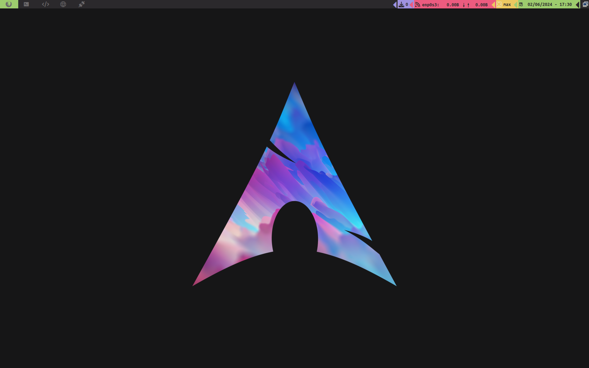
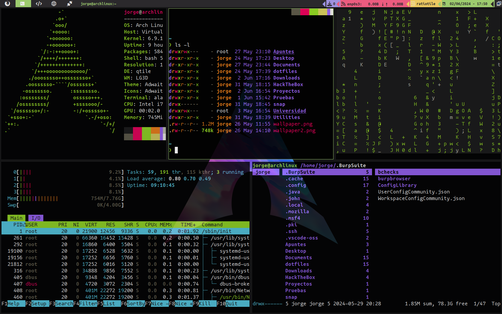
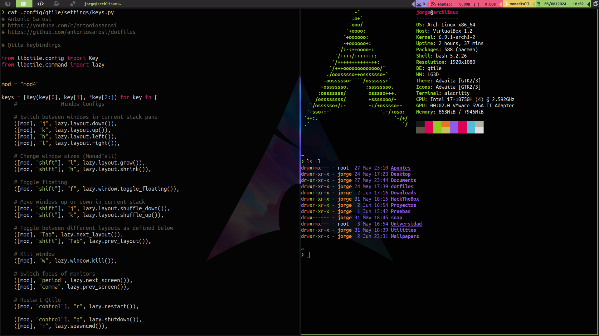

# Auto-Arch
Auto arch is a Bash script which sets up a professional working space using the tiling window manager [qtile](https://qtile.org).

## Usage
1. Clone the repository and navigate to the folder
```shell
git clone https://github.com/jofmar00/Auto-Arch
cd Auto-Arch
```
2. Execute the script!
```shell 
./Auto-Arch.sh
```
## Overview



 




## Key Bindings
### Aplications
<kbd>Windows</kbd> + <kbd>Enter</kbd> Open a new terminal.

<kbd>Windows</kbd> + <kbd>W</kbd> Kill the current tab.

<kbd>Windows</kbd> + <kbd>M</kbd> Open Rofi.

<kbd>Windows</kbd> + <kbd>Shift</kbd> + <kbd>M</kbd> Show open tabs.

<kbd>Windows</kbd> + <kbd>B</kbd> Open Firefox.

<kbd>Windows</kbd> + <kbd>E</kbd> Open Fire explorer.

<kbd>Windows</kbd> + <kbd>S</kbd> Take a screenshot.

<kbd>Windows</kbd> + <kbd>Shift</kbd> +<kbd>S</kbd> Take a screenshot of a selected area.

### Navigation
<kbd>Windows</kbd> + <kbd>(J,K,H,L)</kbd> Switch focus on window down, up, left, right respetively.

<kbd>Windows</kbd> + <kbd>(1,2,3,4,5,6,7,8,9)</kbd> Switch to the respective workspace.

<kbd>Windows</kbd> + <kbd>Shift</kbd> + <kbd>(1,2,3,4,5,6,7,8,9)</kbd> Move current window to respective workspace.

### Window layout managment
<kbd>Windows</kbd> + <kbd>TAB</kbd> Toggle between different window layouts.

<kbd>Windows</kbd> + <kbd>Shift</kbd> + <kbd>TAB</kbd> Toggle between different layouts in inverse order.

<kbd>Windows</kbd> + <kbd>Shift</kbd> + <kbd>F</kbd> Toggle floating window.

<kbd>Windows</kbd> + <kbd>Shift</kbd> + <kbd>(L, H)</kbd> Change window sizes (grow, shrink).

### Other
<kbd>Windows</kbd> + <kbd>CTRL</kbd> + <kbd>R</kbd> Restart Qtile.

<kbd>Windows</kbd> + <kbd>CTRL</kbd> + <kbd>Q</kbd> Log-out.

## Technologies used
This arch configuration uses the following software:
- **WINDOW MANAGER**: [qtile](https://qtile.org)
- **TERMINAL**: [alacritty](https://github.com/alacritty/alacritty)
- **COMPOSITOR**: [picom](https://github.com/yshui/picom)
- **WALLPAPER**: [feh](https://github.com/derf/feh)
- **LAUNCHER**: [rofi](https://github.com/davatorium/rofi)
- **FILE EXPLORER**: [pcmanfm](https://wiki.archlinux.org/title/PCManFM)
- **WEB BROWSER**: [firefox](https://www.mozilla.org/en-US/firefox/new/)
- **GREETER**: [lightdm](https://wiki.archlinux.org/title/LightDM)
- **SCREENSHOT**: [scrot](https://man.archlinux.org/man/scrot.1)
- **PROMPT**: [starship](https://starship.rs)

## Credits
- The Qtile config files are based of [Antonio Sarosi](https://github.com/antoniosarosi) dotfile repository
